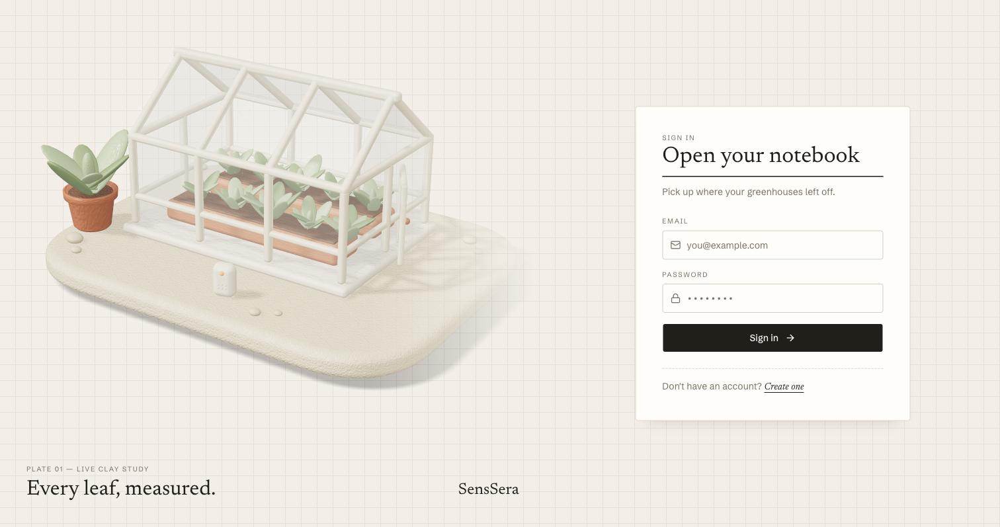
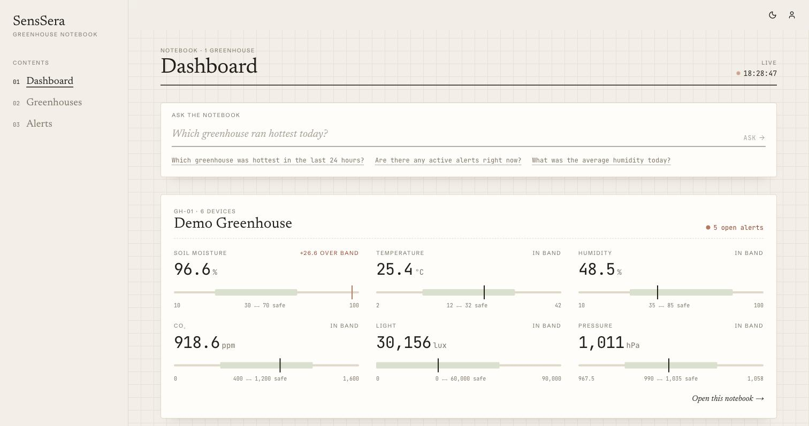
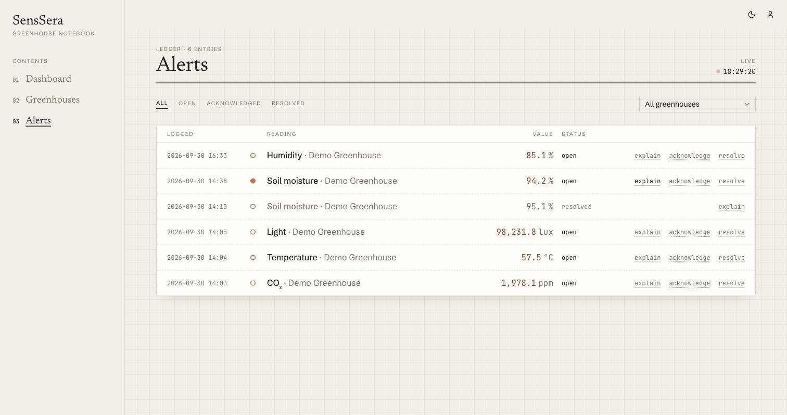
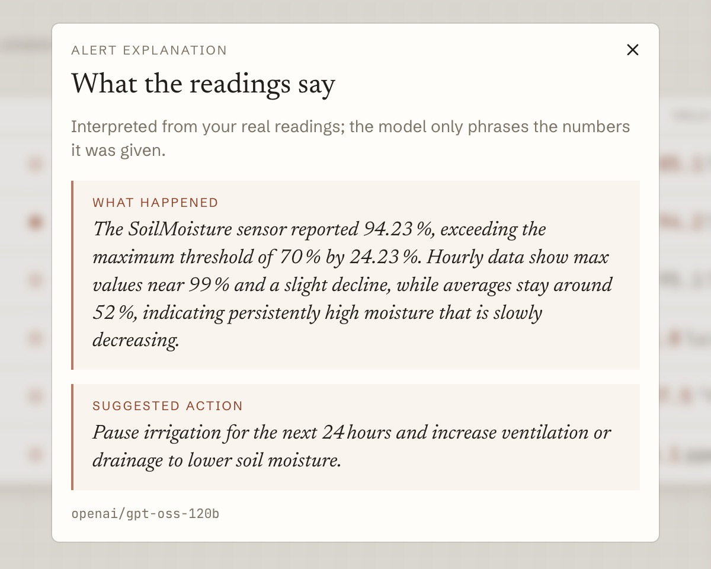

# SensSera

[](https://github.com/bherduran/SensSera/actions/workflows/ci.yml)
[](https://github.com/bherduran/SensSera/actions/workflows/deploy.yml)

Multi-tenant smart greenhouse monitoring SaaS: sensor ingestion, time-series storage, threshold alerts, a live dashboard, and an LLM layer that explains alerts and answers questions about your own data.

**Live demo: <https://sens-sera.vercel.app>** · sign in with `admin@demo.com` / `Admin1234!`

> Portfolio/learning project. A device simulator stands in for real hardware. The demo runs on a free App Service tier, so the first request after a quiet period can take ~30 s while the API wakes up.



| Dashboard | Alerts ledger | AI explanation |
|---|---|---|
|  |  |  |

## What it does

- **Ingestion:** devices POST readings with a per-device token (`X-Device-Token`, SHA-256 hashed at rest). Readings are validated per metric, stored, and pushed to the browser over SignalR.
- **Alerts:** a background job compares the latest readings to each greenhouse's thresholds. It raises at most one open alert per threshold, with severity scaled by how far the value overshoots the safe band.
- **Dashboard:** every metric is shown as a *band gauge* (value, safe range and needle), read from hourly rollups rather than raw scans. Values update live.
- **AI insights:** "Explain" turns an alert into a plain-language note plus a suggested action. "Ask the notebook" answers questions like "which greenhouse ran hottest today?". The model only chooses from whitelisted, typed tools; the service runs the queries through the tenant filter, and the model never sees or writes SQL.
- **Multi-tenancy:** a shared schema with `OrganizationId` on every tenant-owned row, enforced by an EF Core global query filter fed from the JWT. Cross-tenant access returns `404`, not `403`.

## Architecture

```
Browser ──► Vercel (Next.js)
               │  /api, /hubs proxied (same origin → first-party auth cookie, no CORS)
               ▼
         Azure App Service (.NET 10 API, SignalR, background jobs)
               │                              │
               ▼                              ▼
   Azure Database for PostgreSQL     Azure Key Vault
   (Azure-only firewall, SSL)        (read via managed identity)
```

The .NET solution is layered with one-way references: `Api → Application + Infrastructure`, `Infrastructure → Application + Domain`, `Application → Domain`, and `Domain` references nothing.

### Deployment

- **API:** `.github/workflows/deploy.yml` runs on every merge to `main` that touches the API. It runs the unit tests, publishes, and deploys to App Service, then waits on `/api/health`. GitHub authenticates to Azure with **OIDC** (a federated credential): no Azure secret is stored in GitHub. The deploy identity can only touch this one web app, and only from the `production` environment, which only accepts `main`.
- **Secrets:** the DB connection string, JWT signing key and LLM key live in Key Vault. The app settings contain `@Microsoft.KeyVault(...)` references that App Service resolves with the app's managed identity, so no secret sits in config or the repo.
- **Frontend:** Vercel's Git integration builds `senssera-web/` on every push. `API_ORIGIN` points the rewrites at the Azure API.
- **Database:** migrations are applied on startup.

## Stack

- **Backend:** ASP.NET Core (.NET 10), EF Core, PostgreSQL, SignalR, FluentValidation, Serilog
- **Auth:** JWT access token (kept in memory) and a rotating httpOnly refresh cookie with reuse detection (a replayed token revokes every session), BCrypt passwords
- **Frontend:** Next.js 16, TypeScript, Tailwind v4, shadcn/ui primitives, TanStack Query, Recharts, three.js, Motion. API types are generated from the OpenAPI document.
- **AI:** provider-agnostic `ILlmClient` with Groq (`openai/gpt-oss-120b`, used in the demo) and Anthropic adapters
- **Ops:** Docker Compose, GitHub Actions (CI + OIDC deploy), Azure App Service / PostgreSQL / Key Vault, Vercel, Dependabot, Testcontainers

## Run it locally

```bash
cp .env.example .env          # optional: add a free Groq key for AI insights
docker compose up -d --build
```

Open <http://localhost:3000> and sign in with `admin@demo.com` / `Admin1234!`. The API applies migrations, seeds the demo org, and the simulator provisions a demo greenhouse with six sensors and thresholds, then streams readings in alert mode. Alerts appear within a minute. API docs (Scalar) are at <http://localhost:5010/scalar>.

Without an LLM key the two AI features answer `503` and everything else works.

### Development without Docker for the app

```bash
docker compose up -d db
dotnet ef database update --project src/SensSera.Infrastructure --startup-project src/SensSera.Api
dotnet run --project src/SensSera.Api          # http://localhost:5010
dotnet run --project src/SensSera.Simulator    # provisions demo devices itself
cd senssera-web && npm install && npm run dev  # http://localhost:3000
```

The API needs a gitignored `src/SensSera.Api/appsettings.Development.json` with `ConnectionStrings:DefaultConnection` and `Jwt:Key/Issuer/Audience`. For AI locally, run `dotnet user-secrets set "Llm:ApiKey" "<key>"` in `src/SensSera.Api` and set `"Llm": { "Provider": "Groq", "Model": "openai/gpt-oss-120b" }`.

## Tests

```bash
dotnet test SensSera.slnx            # unit + integration (integration needs Docker)
cd senssera-web && npm test          # frontend unit tests (Vitest)
```

- `tests/SensSera.UnitTests`: services on EF InMemory with a fake clock.
- `tests/SensSera.IntegrationTests`: the real API on a throwaway PostgreSQL container, including the end-to-end path from ingest to threshold breach to alert to SignalR event, refresh-token rotation and reuse detection, and tenant isolation.
